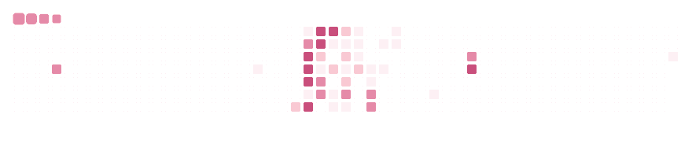

## 🩺 About me

<table>
<tr>
<td align="center" width="50%">

🎓 **B.Eng. Intelligent Systems Science & Engineering** · *Major: Artificial Intelligence*
*Harbin Engineering University* — College of Intelligent System and Automation · 2024–present

</td>
<td align="center" width="50%">

📚 **B.Sc. Industrial Technology**
*Sukhothai Thammathirat Open University* — Production Engineering Technology & Management · 2024–present

</td>
</tr>
</table>

- 💼 Currently **Data & AI Intern at Video KB** — shipping AI-agent features for *AILY Cowork*, an enterprise agent app extending the open-source **OpenWorker**
- 🔬 Research: **Marine Digital Twins** (graph models · simulation · sensor fusion) & **AI Cultural Logic Alignment (CLAP)** — preserving Thai calendrical logic in LLMs via Knowledge Graphs + RAG
- 🎤 Presented CLAP policy work at **Google's 2026 Online Safety Dialogue** (UNITAR × Renmin University)
- 👑 Two petty patents pending: pineapple-leaf-fibre air filtration & PCM cold-chain logistics
- 🗣 ไทย (native) · English (IELTS 5.0) · 中文 (HSK 4) — a Thai AI student living in Harbin 🇨🇳
- 💬 Ask me about RAG evaluation loops, GNNs, or juggling a double degree across two countries

## 💼 Experience

**Video KB** · *Data & AI Intern* — 6 Jul 2026 – 28 Oct 2026
*AILY Cowork* — enterprise AI-agent desktop app, extended from the open-source **OpenWorker**

- Shipped **8 production AI-agent features** across a full stack: Python backend · React/TypeScript frontend · Rust/Tauri desktop shell
- Built an **LLM-powered Knowledge Graph** (entity/relation extraction → force-directed ECharts) plus a browser knowledge-upload flow grounding the agent in user files
- Designed **Debate Mode** — parallel opposing LLM calls synthesized by an **LLM-as-a-judge**, with keyword scoring + Pydantic filtering for cited, grounded answers
- Engineered **Multi-agent RAG** (LangGraph) with parallel retrieval over text, image OCR & video transcripts (ffmpeg), served as **SSE streaming** on async FastAPI
- Cut serving cost via **multi-model routing (LiteLLM)**; added a Faithfulness/Relevance eval loop with human feedback logged to SQLite
- Ported the app to Windows with full Thai localization; template-driven Office generation (Markdown → PPTX/DOCX/XLSX)

## 🚀 Featured projects

<table>
<tr>
<td align="center">

 
👑 <b>Petty Patent Pending</b> · AI-optimized PALF pleated filter 
98.01% capture efficiency · 5.46 Pa pressure drop · Python → CAD geometry pipeline

</td>
<td align="center">

 
👑 <b>Petty Patent Pending</b> · AI-driven PCM cold-chain box 
Random-Forest traffic routing + heat-transfer simulation · 100% shipment safety @ 40 °C

</td>
</tr>
<tr>
<td align="center">

 
🏆 <b>Top-3</b> coding project · clinical diagnostics via ML 
Random-Forest screening over 130+ symptoms · confidence-scored output · JS symptom UI

</td>
<td align="center">

<b>🚧 Marine Digital Twin</b> 
Predictive digital twin for marine assets — graph models, simulation & sensor fusion 
Research in progress · code coming soon ✨

</td>
</tr>
</table>

## 🧰 Tech stack

  
  
  
  
  
  
  
  

  
  
  
  
  
  
  
  

  
  
  
  
  
  
  
  
  
  
  
  

covers what I actually ship with — from my repos, internship work &amp; resume 🙂

## 🐍 My contributions, munched daily

## 📫 Let's connect

  
  

---

<i>“Bridging code, clinics, and currents.”</i> 🧬🩺🌊

